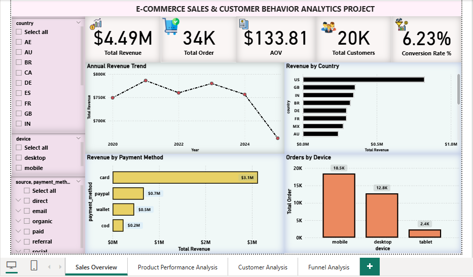
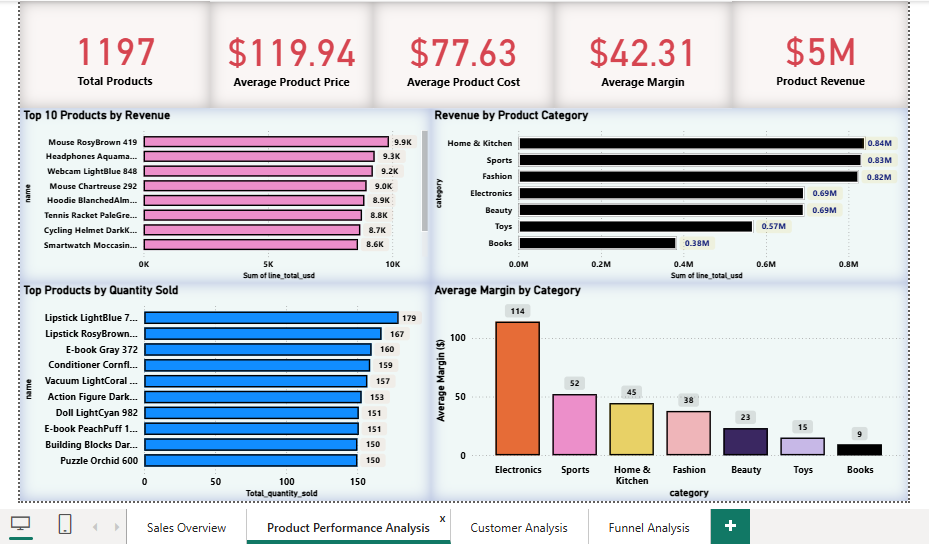
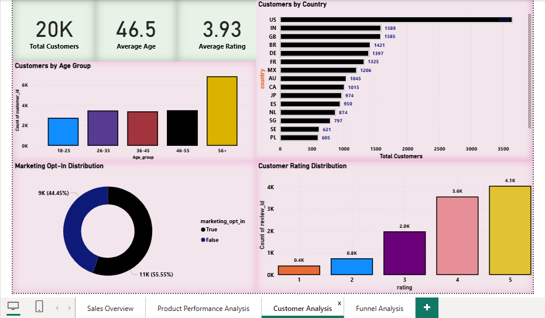
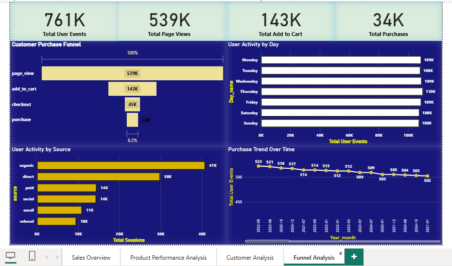

# E-Commerce Sales & Customer Behavior Analytics Project

## Dataset
**E-commerce Transactions + Clickstream Dataset**

## Tools Used
- Excel
- SQL Server (SSMS)
- Power BI

## Project Overview
This project analyzes e-commerce transactions and customer clickstream data to evaluate sales performance,
customer behavior, and conversion trends. 
Using Excel, SQL Server, and Power BI, the project transforms raw data into interactive dashboards and business insights.

## Key Objectives
- Analyze sales performance and revenue trends
- Identify top-performing products and product categories
- Analyze customer purchasing behavior
- Analyze revenue by country, payment method, and device type
- Measure customer conversion rate using clickstream events
- Build interactive dashboards for business analysis

## Dashboard Preview

### 01. Sales Overview

### 02. Product Analysis

### 03. Customer Analysis

### 04. Funnel Analysis

## Project Files

- 📊 **Power BI Report (.pbix):** [Download from Google Drive] (https://drive.google.com/file/d/14uHBvdcORn5PctjikOpQi3FDU1elWMuv/view?usp=sharing)
- 📄 **Excel Workbook (.xlsb):** [Download from Google Drive](YOUR_EXCEL_LINK)
- 🗄️ **SQL Script:** `E-Commerce Analytics.sql`
- 
